<!-- TOC depthFrom:1 depthTo:6 withLinks:1 updateOnSave:1 orderedList:0 -->

- [Hadoop的起源与体系介绍](#hadoop的起源与体系介绍)
	- [Hadoop的思想之源：Google](#hadoop的思想之源google)
		- [Google的低成本之道](#google的低成本之道)
		- [集装箱数据中心](#集装箱数据中心)
	- [Google面对的数据和计算难题](#google面对的数据和计算难题)
		- [大量的网页如何存储？](#大量的网页如何存储)
		- [搜索算法-倒排索引](#搜索算法-倒排索引)
		- [Page-Rank计算问题](#page-rank计算问题)
			- [算法体验-Google矩阵](#算法体验-google矩阵)
			- [PageRank简介](#pagerank简介)
			- [PageRank算法](#pagerank算法)
			- [计算PR值](#计算pr值)
		- [Google带给我们的关键技术和思想](#google带给我们的关键技术和思想)
	- [Hadoop的源起——Lucene](#hadoop的源起lucene)
		- [从lucene到nutch，从nutch到hadoop](#从lucene到nutch从nutch到hadoop)
			- [目前Hadoop达到的高度](#目前hadoop达到的高度)
		- [Hadoop子项目家族](#hadoop子项目家族)
		- [Hadoop的架构](#hadoop的架构)
			- [Namenode](#namenode)
			- [Secondary Namenode](#secondary-namenode)
			- [DataNode](#datanode)
			- [JobTracker](#jobtracker)
			- [TaskTracker](#tasktracker)
			- [Master与Slave](#master与slave)
		- [Why hadoop？](#why-hadoop)
			- [场景：电信运营商信令分析与监测](#场景电信运营商信令分析与监测)
				- [数据分析者面临的问题](#数据分析者面临的问题)
				- [数据分析者期待的解决方案](#数据分析者期待的解决方案)
			- [Hadoop的思想](#hadoop的思想)
		- [Why not Hadoop？](#why-not-hadoop)
		- [Hadoop体系下的分析手段](#hadoop体系下的分析手段)
	- [课后练习_通过PageRank算法计算网页PR值](#课后练习通过pagerank算法计算网页pr值)
- [通过python脚本协助计算结果如下](#通过python脚本协助计算结果如下)

<!-- /TOC -->
# Hadoop的起源与体系介绍

> 2018-09-05 BoobooWei

*这个讲义比较老，但是原理讲得非常细致，建议作为学习的第一部分。*

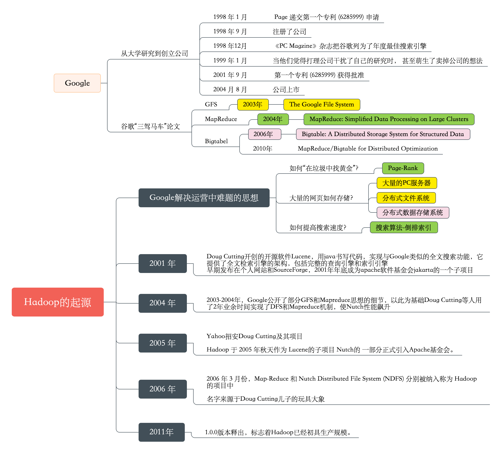


- [1998@The Anatomy of a Large-Scale Hypertextual Web Search Engine](http://infolab.stanford.edu/pub/papers/google.pdf)
- [1998@The PageRank Citation Ranking: Bringing Order to the Web](hadoop_pdf/Google/pageranksub.pdf)  
- [2003@ai.google@The Google File System](https://ai.google/research/pubs/pub51)
- [2004@www.usenix.org@MapReduce: Simplified Data Processing on Large Clusters](https://www.usenix.org/legacy/events/osdi04/tech/full_papers/dean/dean.pdf)--
- [2004@ai.google@MapReduce: Simplified Data Processing on Large Clusters](https://ai.google/research/pubs/pub62)
- [2006@www.usenix.org@Bigtable: A Distributed Storage System for Structured Data](https://www.usenix.org/legacy/event/osdi06/tech/chang/chang_html/index.html)
- [2010@ai.google@MapReduce/Bigtable for Distributed Optimization](https://ai.google/research/pubs/pub36948)

国内中文翻译参考：

* [Google-GFS 中文](https://github.com/BoobooWei/booboo_hadoop/blob/master/hadoop_pdf/Google/Google-File-System%E4%B8%AD%E6%96%87%E7%89%88_1.0.pdf)
* [Google-MapReduce 中文](https://github.com/BoobooWei/booboo_hadoop/blob/master/hadoop_pdf/Google/Google-MapReduce%E4%B8%AD%E6%96%87%E7%89%88_1.0.pdf)
* [Google-Bigtable 中文](https://github.com/BoobooWei/booboo_hadoop/blob/master/hadoop_pdf/Google/Google-Bigtable%E4%B8%AD%E6%96%87%E7%89%88_1.0.pdf)

## Hadoop的思想之源：Google

Google搜索引擎，Gmail，安卓，AppspotGoogle Maps，Google earth，Google学术，Google翻译，Google+，下一步Google what？？

大家比较熟悉的Google产品：

* google搜索引擎 www.google.com.hk
* google学术搜索 [scholar.google.com.hk](scholar.google.com.hk)
* android操作系统
* Chrome

Hadoop几乎是google搜索引擎有关技术的百分之一百的山寨版。

### Google的低成本之道

* 不使用超级计算机，不使用存储（淘宝的去i，去e，去o之路）
* 大量使用普通的pc服务器（去掉机箱，外设，硬盘），提供有冗余的集群服务
* 全世界多个数据中心，有些附带发电厂
* 运营商向Google倒付费


### 集装箱数据中心

* 位于 Mountain View， Calif 总部的数据中心
* 总功率为10000千瓦，拥有45个集装箱，每个集装箱中有1160台服务器，该数据中心的能效比为1.25（ PUE 为 1 表示数据中心没有能源损耗，而根据2006年的统计，一般公司数据中心的能效比为 2.0 或更高。Google 的 1.16 已经低于美国能源部2011年的1.2 的目标）

Google作为一家互联网公司，在创业的时候是很穷的，创始人是两个大学生。当然现在已经发财了，大发特发，但是当初那种节约的思想到今天还在持续。

实际上在世界上任何一家互联网公司，一般来说都是比较省的，为什么呢？因为互联网公司的营业模式通常都会不是很成熟，前期都会很烧钱，烧完钱后还能不能继续下去还是个未知数，因此遇到烧钱的事都会比较谨慎，他们很可能不会去购买很昂贵的硬件。

那么像Google这么大的规模，如果在一台超级计算机上跑，像天河那种估计也跑不动，如果去买很多超级计算机，那估计没有这个能力。另外像Google的信息量非常大，需要很大的存储，而存储也很贵。还有软件，例如数据存在Oracle中，那么购买license，估计把Google卖给Oracle都不够。因此Google使用大量的PC服务器。

由于只需要CPU、内存和主板，因此一开始Google将机箱都去掉了，当然现在已经加了机箱。

## Google面对的数据和计算难题

google解决运营中难题的思想后来就成了Hadoop

### 大量的网页如何存储？

通过爬虫去爬去大量的网页，这些网页如何存取呢？Google不会选择昂贵的存储设备，google的服务器都是没有硬盘的，爬回来的网页都存放在内存里面，来加快检索的速度。如果断电了，是不是内存中失去信息了，Google会采取冗余的方法，hadoop不会将数据存在内存中，但是同样也采用冗余的方式，采用多节点写入。

### 搜索算法-倒排索引

搜索的速度一般在毫秒级别，例如自己手动做个实验，去Google搜索一个关键字耗时0.45秒。


如果我们在关系型数据库中去近似匹配`索引`这个关键字时，例如

```sql
select * from tb where col like '%索引%';
```

这个是时候时不能使用到索引的，上亿行记录时速度更慢，当然现在有全文索引，但是速度肯定还是达不到毫秒级别的。

Google如何快速搜索网页的呢？主要是用了一种**倒排索引**的技术，我们可以对全文进行索引，但是索引的关键字，并不是文章内容的全部，而是首先将文章进行分词。

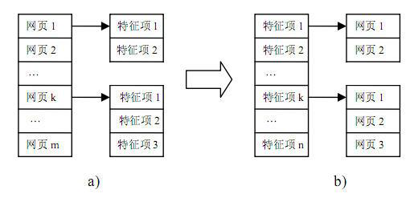

**举个例子**

文章1`我爱北京天安门`，进行分词：

* 我
* 爱
* 北京
* 天安门

文章2`我爱你北京`，进行分词：

* 我
* 爱
* 你
* 北京

根据两个文章的分词统计，得到统计表

| 单词ID | 单词   | 倒叙排列表  |
| ------ | ------ | ----------- |
| 1      | 我     | (1:1),(2:1) |
| 2      | 爱     | (1:2),(2:2) |
| 3      | 北京   | (1:3),(2:4) |
| 4      | 天安门 | (1:5)       |
| 5      | 你     | (2:3)       |

单词`我`出现在标识号为1的网站的1的位置，还出现在标识为2的网站的1的位置。

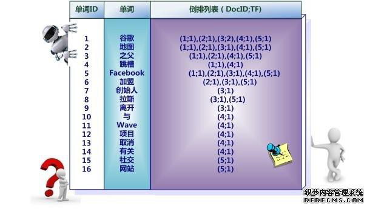

因此倒排列表可以快速进行查询。

这里还有一个难题，就是`分词`，英语中分词非常方便，但是中文、日语，由于词汇之间没有一个明显的分界，这里有一个方法，例如用字典。

```shell
我爱北京天安门。我、爱、北、北京、天、安、门、天安门，如果在字典中，则分词
```

### Page-Rank计算问题

Page Rank是Google最核心的算法，用于给每个网页价值评分，是Google“在垃圾中找黄金”的关键算法，这个算法成就了今天的Google！

如果将搜索的网页不加过滤时全部推送给客户，那么就会有很多垃圾网站。

Google通过Page-Rank对网页进行计算排名。

Page Rank从来没有被Google公开过，大家都是从Google开放出来的数学论文去探究的，这个是Google的核心秘密。

#### 算法体验-Google矩阵


上图中的矩阵是如何得到的呢？

> 从源端到目标端有多少个指向

| 目标\|源端 | 1号网页 | 2号网页 | 3号网页 | 4号网页 |
| ---------- | ------- | ------- | ------- | ------- |
| 1号网页    | 0       | 0       | 0       | 0       |
| 2号网页    | 1       | 0       | 0       | 1       |
| 3号网页    | 1       | 1       | 0       | 0       |
| 4号网页    | 1       | 1       | 1       | 0       |
| Total      | 3       | 2       | 1       | 1       |

通过如上统计得到矩阵
$$
G=
\begin{bmatrix}
0&0&0&0\\
\frac{1}{3}&0&0&1\\
\frac{1}{3}&\frac{1}{2}&0&0\\
\frac{1}{3}&\frac{1}{2}&1&0\\
\end{bmatrix}
$$
至此，我们通过一个小实验已经体验了一次Page Rank的计算过程，接下来我们详细来了解该算法。

#### PageRank简介

* 1998年，斯坦福大学的Brin和Page第一次提出了基于网页链接分析的算法PageRank，并在此基础上诞生了一个伟大的公司Google
* PageRank借鉴了引文分析的基本思想，认为一个超链接（类似引文分析中的一次引用）就是一个推荐，一个拥有更多入链的网页应该比一个更少入链的网页更加重要。
* 但是与被引次数不同的是，PageRank不仅是考虑入链网页的多少，还考虑入链的网页的重要性，PageRank算法有个假设，如果一个网页被一个重要的网页链接，那么它也应该是一个重要的网页。
*  PageRank算法是综合考虑入链网页的数量和质量从而计算网页的分数。

#### PageRank算法

Google的算法

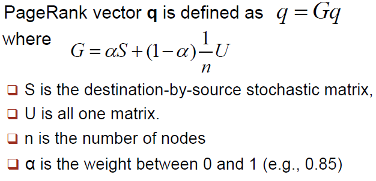


```shell
算法:求出第一个特征向量的递推方法
```


#### 计算PR值

通过算法体验中的小例子，我们人工计算了4个网页的PR值，但是Google要计算的网页可能是十几个亿，那么矩阵的元素有十几亿乘以十几亿，下面看看用多台计算机，分布式地计算，如何实现？


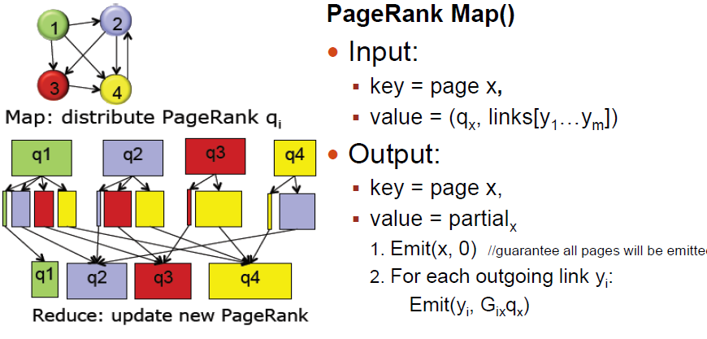

网页分布在不同的服务器节点上

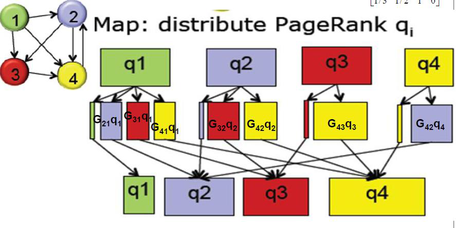

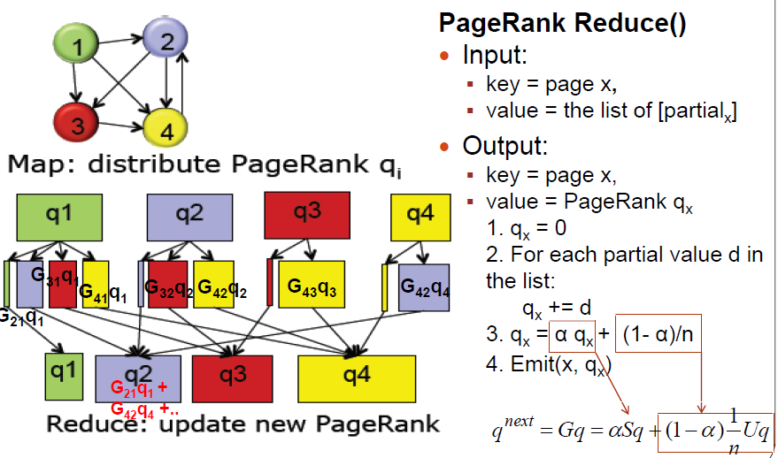


将一个巨大的计算任务，通过map映射到各个的节点来进行分布式计算，每个节点只要抗下一小块负荷，通过两万个屌丝就变成了高富帅，然后汇总到一个节点，汇总的过程叫做reduce，将汇总的结果再分发到各个节点，再汇总，反复多次后，pagerank就被算出来了。

[谷歌背后的数学](https://www.changhai.org/articles/technology/misc/google_math.php)

### Google带给我们的关键技术和思想

* GFS
* Map-Reduce
* Bigtable（后面讲）


## Hadoop的源起——Lucene

* Doug Cutting开创的开源软件，用java书写代码，实现与Google类似的全文搜索功能，它提供了全文检索引擎的架构，包括完整的查询引擎和索引引擎
* 早期发布在个人网站和SourceForge，2001年年底成为apache软件基金会jakarta的一个子项目
* Lucene的目的是为软件开发人员提供一个简单易用的工具包，以方便的在目标系统中实现全文检索的功能，或者是以此为基础建立起完整的全文检索引擎
* 对于大数量的场景，Lucene面对与Google同样的困难。迫使Doug Cutting学习和模仿Google解决这些问题的办法
* 一个微缩版：Nutch


### 从lucene到nutch，从nutch到hadoop

* 2003-2004年，Google公开了部分GFS和Mapreduce思想的细节，以此为基础Doug Cutting等人用了2年业余时间实现了DFS和Mapreduce机制，使Nutch性能飙升

* Yahoo招安Doug Cutting及其项目
* Hadoop 于 2005 年秋天作为 Lucene的子项目 Nutch的 一部分正式引入Apache基金会。2006 年 3 月份，Map-Reduce 和 Nutch Distributed File System (NDFS) 分别被纳入称为 Hadoop 的项目中
* 名字来源于Doug Cutting儿子的玩具大象


#### 目前Hadoop达到的高度

* 实现云计算的事实标准开源软件
* 包含数十个具有强大生命力的子项目
* 已经能在数千节点上运行，处理数据量和排序时间不断打破世界纪录

### Hadoop子项目家族

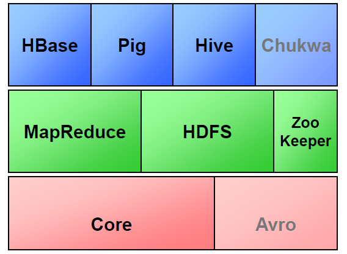

* MapReduce和HDFS是Hadoop的两大支柱。
* Hbase：列式存储
* Pig：在Hadoop上进行开发的语言主要我们都知道Hadoop是Java写的，但是我们也需要一些其他语言来支持，Pig就类似于shell命令，自动将shell命令转化为MapReduce的语言，就像是一个转换器。
* Hive：是一个非常有用的子项目，用于SQL开发

### Hadoop的架构

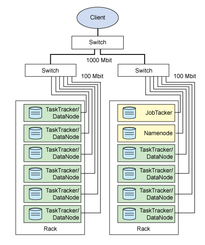

首先给大家讲一下Hadoop的架构，让大家有一些基本的认识。

上图是按照机房的机柜来画的，每一个长方形是一个物理节点，通过网线连接到交换机。大家可以看到有些标识：datanode、namenode、jobtracker、tasktracker等，这些都是后台进程。

这里面最重要的就是namenode。

#### Namenode

> Namenode可以翻译成“名称节点”，是HDFS的守护程序，他起到分布式文件系统的总控的作用。首先会记录所有的元数据，比如，会记录每一个文件是怎么记录的，会记录在哪个节点，也会对内存和IO进行管理。
>
> 访问Hadoop集群时，一般情况下会先访问Namenode，了解数据分布的情况后，才能去具体的数据节点访问数据。NameNode还是单点（2012年），发生故障会导致集群故障

* HDFS的守护程序

* 纪录文件是如何分割成数据块的，以及这些数据块被存储到哪些节点上

* 对内存和I/O进行集中管理

* 是个单点，发生故障将使集群崩溃

  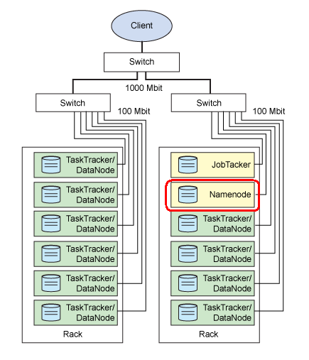

#### Secondary Namenode

> Secondary Namenode可以翻译为“辅助节点”，实时同步Namenode的元数据，一旦Namenode故障，则可以手动切换到辅助节点。目前不能自动故障转移（2012年）。

* 监控HDFS状态的辅助后台程序
* 每个集群都有一个
* 与NameNode进行通讯，定期保存HDFS元数据快照
* 当NameNode故障可以作为备用NameNode使用

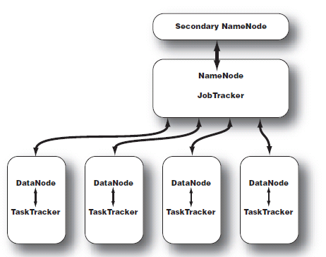

#### DataNode

> DataNode是运行在数据节点的后台进程，数据节点运行在子节点，我们称存放数据的节点为slave。而Namenode、secondary namenode我们称为master。

* 每台从服务器都运行一个

* 负责把HDFS数据块读写到本地文件系统

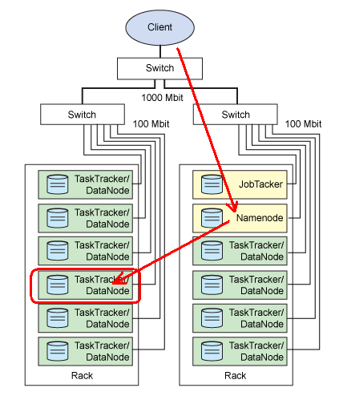

#### JobTracker

> 作业跟踪器，运行在master上的很重要的进程，对MapReduce体系的总控作用。

* 用于处理作业（用户提交代码）的后台程序
* 决定有哪些文件参与处理，然后切割task并分配节点
* 监控task，重启失败的task（于不同的节点）
* 每个集群只有唯一一个JobTracker，位于Master节点

#### TaskTracker

> 在Slave中既有管理HDFS的DataNode，又有管理MapReduce的TaskTracker

* 位于slave节点上，与datanode结合（代码与数据一起的原则）
* 管理各自节点上的task（由jobtracker分配）
* 每个节点只有一个tasktracker，但一个tasktracker可以启动多个jvm，用于并行执行map或者reduce任务
* 与jobtracker交互

#### Master与Slave

> 测试环境可以选择3台服务器，一台作为Master，两台作为Slave

* Master：Namenode、Secondary Namenode、Jobtracker。浏览器（用于观看 管理界面），其它Hadoop工具
* Slave：Tasktracker、Datanode
* Master不是唯一的

### Why hadoop？


#### 场景：电信运营商信令分析与监测

* 原数据库服务器配置：HP小型机，128G内存，48颗CPU，2节点RAC，其中一个节点用于入库，另外一个节点用于查询
* 存储：HP虚拟化存储，>1000个盘
* 数据库架构采用Oracle双节点RAC
* 问题：1 入库瓶颈 2 查询瓶颈

##### 数据分析者面临的问题

* 数据日趋庞大，无论是入库和查询，都出现性能瓶颈
* 用户的应用和分析结果呈整合趋势，对实时性和响应时间要求越来越高
* 使用的模型越来越复杂，计算量指数级上升

##### 数据分析者期待的解决方案

* 完美解决性能瓶颈，在可见未来不容易出现新瓶颈
* 过去所拥有的技能可以平稳过渡。比如SQL、R
* 转移平台的成本有多高？平台软硬件成本，再开发成本，技能再培养成本，维护成本

#### Hadoop的思想

> 100个屌丝可以替代一个高富帅


### Why not Hadoop？

* Java？
* 难以驾驭？
* 数据集成困难？
* Hadoop vs Oracle

### Hadoop体系下的分析手段

* 主流：Java程序
* 轻量级的脚本语言：Pig
* SQL技巧平稳过渡：Hive
* NoSQL：HBase

---

## 课后练习_通过PageRank算法计算网页PR值

网页之间的链家指向关系如下图所示。

```mermaid
graph LR
A[A网站]-->B[B网站]
A[A网站]-->C[C网站]
A[A网站]-->D[D网站]
B[B网站]-->C[C网站]
B[B网站]-->D[D网站]
C[C网站]-->D[D网站]
D[D网站]-->B[B网站]
```

使用markdown画出来稍微丑了点，但是网站间的指向是没有问题的。也可以参照下图：


**第一步：计算每一个网站的“概率转移矩阵”，我们用$S_a S_b S_c S_d $表示。**

$$
S_a = \begin{bmatrix}
0\\
\frac{1}{3}\\
\frac{1}{3}\\
\frac{1}{3}\\
\end{bmatrix}
S_b = \begin{bmatrix}
0\\
0\\
\frac{1}{2}\\
\frac{1}{2}\\
\end{bmatrix}
S_c = \begin{bmatrix}
0\\
0\\
0\\
1\\
\end{bmatrix}
S_d = \begin{bmatrix}
0\\
1\\
0\\
0\\
\end{bmatrix}
$$

如何来计算概率转移矩阵呢？通俗易懂的方法 指向某个网站的个数/源端总的指向数

```shell
1. 如果我是一个网站，那么我链接了多少个网站（除自己以外的）表示为 N ？比如A网站，链接了B、C、D，则一共链接了3个网站，则N=3。
2. 链接概率为链接数/N；有一个B的链接，那么概率为1/3；有一个C的链接，那么概率为1/3；有一个D的链接，那么概率为1/3。
3. 按照以下顺序组成矩阵 A:0/3,B:1/3,C:1/3,D:1/3
```

> 如果指向同一个网站的链接数为多个，也只算1

**第二步：根据 $G = \alpha S + ( 1 - \alpha ) \frac{1}{N} U$ 计算 $G_a G_b G_c G_d$**

* $\alpha$ 为0~1之间的值，是google工程师的一个经验值，例如0.85

* $S$ 是第一步中计算的网站概率转移矩阵

* $\frac{1}{N} U$ 其中N为网页的总数，$U$ 为元素全为 $1$ 的 $N$ 阶向量；例如题目中N=4，那么
  $$
  \frac{1}{N} U  =
  \frac{1}{4} *
  \begin{bmatrix}
  1\\
  1\\
  1\\
  1\\
  \end{bmatrix}
  $$

  $$
  \frac{1}{N} U  =
  \begin{bmatrix}
  \frac{1}{4}\\
  \frac{1}{4}\\
  \frac{1}{4}\\
  \frac{1}{4}\\
  \end{bmatrix}
  $$


当$\alpha = 0.85$ 时，计算$G_a G_b G_c G_d$ 如下：

---

$$
G_a = 0.85 *  \begin{bmatrix}
0\\
\frac{1}{3}\\
\frac{1}{3}\\
\frac{1}{3}\\
\end{bmatrix} + (1-0.85) * \begin{bmatrix}
\frac{1}{4}\\
\frac{1}{4}\\
\frac{1}{4}\\
\frac{1}{4}\\
\end{bmatrix}
$$

$$
G_a =
\begin{bmatrix}
\frac{3}{80}\\
\frac{77}{240}\\
\frac{77}{240}\\
\frac{77}{240}\\
\end{bmatrix}
$$

---

$$
G_b = 0.85 * \begin{bmatrix}
0\\
0\\
\frac{1}{2}\\
\frac{1}{2}\\
\end{bmatrix} + (1-0.85) * \begin{bmatrix}
\frac{1}{4}\\
\frac{1}{4}\\
\frac{1}{4}\\
\frac{1}{4}\\
\end{bmatrix}
$$

$$
G_b =
\begin{bmatrix}
\frac{3}{80}\\
\frac{3}{80}\\
\frac{37}{80}\\
\frac{37}{80}\\
\end{bmatrix}
$$

---

$$
G_c = 0.85 * \begin{bmatrix}
0\\
0\\
0\\
1\\
\end{bmatrix} + (1-0.85) * \begin{bmatrix}
\frac{1}{4}\\
\frac{1}{4}\\
\frac{1}{4}\\
\frac{1}{4}\\
\end{bmatrix}
$$

$$
G_c =
\begin{bmatrix}
\frac{3}{80}\\
\frac{3}{80}\\
\frac{3}{80}\\
\frac{71}{80}\\
\end{bmatrix}
$$

---

$$
G_d = 0.85 *  \begin{bmatrix}
0\\
1\\
0\\
0\\
\end{bmatrix} + (1-0.85) * \begin{bmatrix}
\frac{1}{4}\\
\frac{1}{4}\\
\frac{1}{4}\\
\frac{1}{4}\\
\end{bmatrix}
$$

$$
G_d = \begin{bmatrix}
\frac{3}{80}\\
\frac{71}{80}\\
\frac{3}{80}\\
\frac{3}{80}\\
\end{bmatrix}
$$

---

$$
G =  \begin{bmatrix}
\frac{3}{80} \frac{3}{80} \frac{3}{80} \frac{3}{80}\\
\frac{77}{240} \frac{3}{80} \frac{3}{80} \frac{71}{80}\\
\frac{77}{240} \frac{37}{80} \frac{3}{80} \frac{3}{80} \\
\frac{77}{240} \frac{37}{80} \frac{71}{80} \frac{3}{80}\\
\end{bmatrix}
$$
**第三步：根据公式 $ q^{next}=Gq^{cur} $** 求出 $q$ 的收敛值。

* 1>向量$q$的初始值是元素全为1的 $N$阶向量


$$
q = \begin{bmatrix}
1\\
1\\
1\\
1\\
\end{bmatrix}
$$

* 2> 计算$q^{next}$


$$
q = \begin{bmatrix}
  1\\
  1\\
  1\\
  1\\
  \end{bmatrix}
  *
  G
$$

* 3>判断$q^{next}是否等于q^{cur} $，如果不相等，则继续以上两步骤，直到$q^{next}=q^{cur} $


按照上面的步骤我们计算一下：

第一轮

当


$$
q^{cur} =
\begin{bmatrix}
1\\
1\\
1\\
1\\
\end{bmatrix}
$$
时，


$$
q^{next} =  
\begin{bmatrix}
\frac{3}{80} \frac{3}{80} \frac{3}{80} \frac{3}{80}\\
\frac{77}{240} \frac{3}{80} \frac{3}{80} \frac{71}{80}\\
\frac{77}{240} \frac{37}{80} \frac{3}{80} \frac{3}{80} \\
\frac{77}{240} \frac{37}{80} \frac{71}{80} \frac{3}{80}\\
\end{bmatrix} * \begin{bmatrix}
1\\
1\\
1\\
1\\
\end{bmatrix}
$$


此时$q^{next}!=q^{cur} $,则


$$
q^{cur} =
\begin{bmatrix}
\frac{3}{20}\\
\frac{77}{60}\\
\frac{103}{120}\\
\frac{41}{24}\\
\end{bmatrix}
$$

继续求 $q^{next}$

$$
q^{next} =  
\begin{bmatrix}
\frac{3}{80} \frac{3}{80} \frac{3}{80} \frac{3}{80}\\
\frac{77}{240} \frac{3}{80} \frac{3}{80} \frac{71}{80}\\
\frac{77}{240} \frac{37}{80} \frac{3}{80} \frac{3}{80} \\
\frac{77}{240} \frac{37}{80} \frac{71}{80} \frac{3}{80}\\
\end{bmatrix} *
\begin{bmatrix}
\frac{3}{20}\\
\frac{77}{60}\\
\frac{103}{120}\\
\frac{41}{24}\\
\end{bmatrix}
$$


$$
q^{next} =
\begin{bmatrix}
\frac{3}{80} * \frac{3}{20} + \frac{3}{80} * \frac{77}{60} + \frac{3}{80} * \frac{103}{120} + \frac{3}{80} * \frac{41}{24} \\
\frac{77}{240} * \frac{3}{20} + \frac{3}{80} * \frac{77}{60} + \frac{3}{80} * \frac{103}{120} + \frac{71}{80} * \frac{41}{24} \\
\frac{77}{240} * \frac{3}{20} + \frac{37}{80} * \frac{77}{60} + \frac{3}{80} * \frac{103}{120} + \frac{3}{80} * \frac{41}{24} \\
\frac{77}{240} * \frac{3}{20} + \frac{37}{80} * \frac{77}{60} + \frac{71}{80} * \frac{103}{120} + \frac{3}{80} * \frac{41}{24} \\
\end{bmatrix}
$$


后续循环不再列出，最终得到收敛的$q$值。

[计算脚本链接地址](https://github.com/BoobooWei/booboo_hadoop/blob/master/python_scripts/booboo_pagerank.py)

```shell
# 通过python脚本协助计算结果如下
迭代次数74
('D', 1.529988694177496)
('B', 1.492990390050871)
('C', 0.8270209157716194)
('A', 0.14999999999999947)
```
